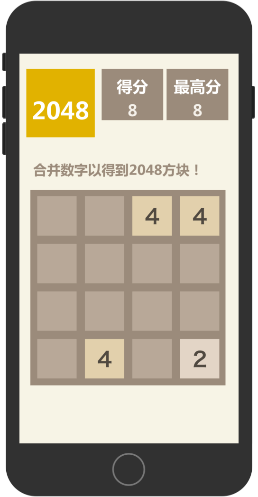

# 2048_Game

2048 is an classical mobile game, and this is my personal game demo.

## Game rules

The rules of the game are very simple. You need to control all the squares to move in the same direction. Two squares of the same number collide and merge into their sum. After each operation, a 2 or 4 is randomly generated, and finally a "2048" is obtained. 

**Try to get higher score!**

##	Get start

1. Download **cocos2d-x library**. [Download Link](https://www.cocos.com/cocos2dx)
2. Create folder named "**cocos2d**" in project dir, then copy all "**cocos2d-x library**" to this folder.
3. Compile project for IOS or Android.

##	Demo pics

Deploy this game on **iPhone 7plus**

##	Links

[http://www.cocos.com/](http://www.cocos.com/)

[about 2048_Game](https://baike.baidu.com/item/2048/15432218?fr=aladdin)

